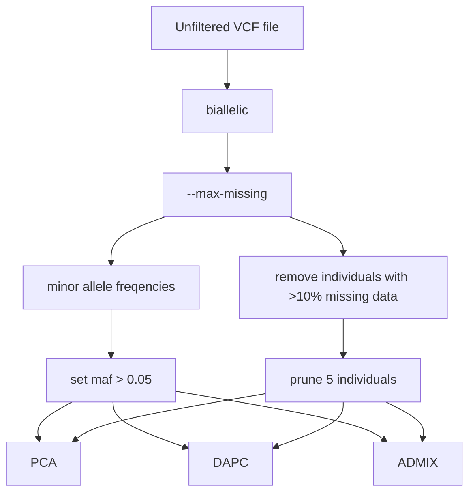
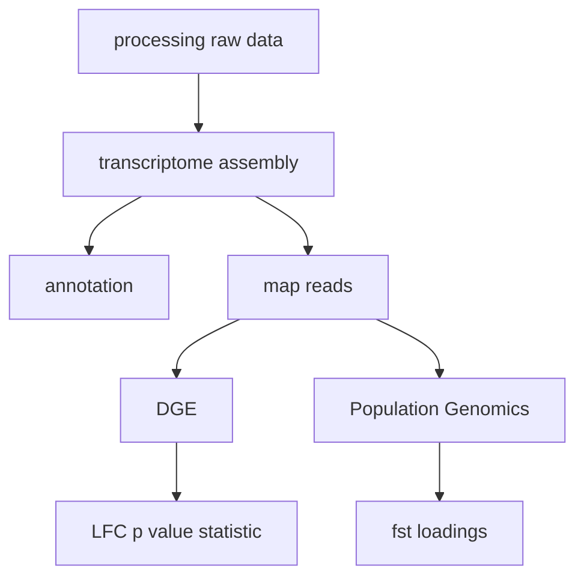
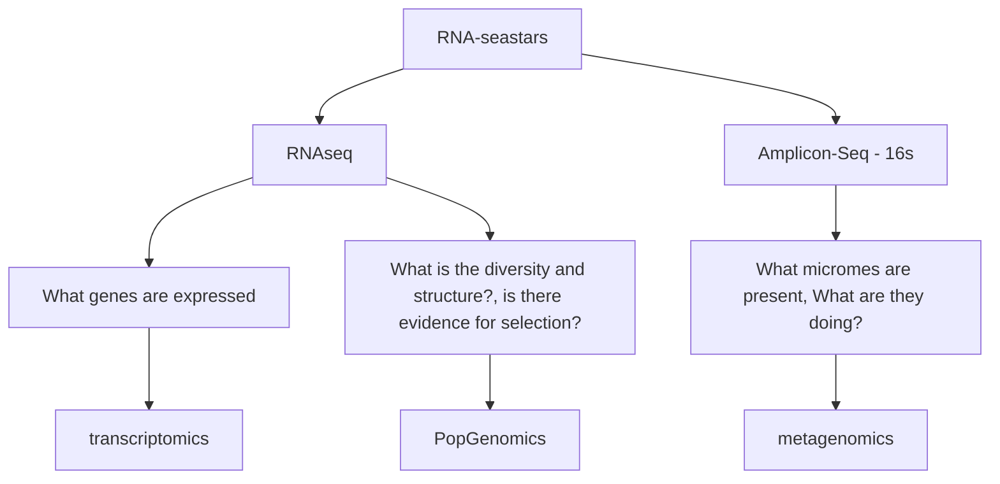
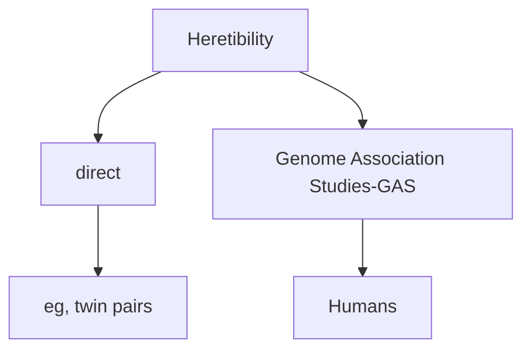

# Online Notebook

### Author: Lisa Chamberland

### Ecological Genomics:

## Overall Description of notebook

fill in your description here!

## Date started: (2017-02-06)

## Date end:   (2017-02-15)

## Philosophy

Science should be reproducible and one of the best ways to achieve this is by logging research activities in a notebook. Because science/biology has increasingly become computational, it is easier to document computational projects in an electronic form, which can be shared online through Github.    

### Table of contents for 10 entries (Format is *Page: Date(with year-month-day). Title*)

- [Page 1: 2017-02-06](#id-section1). RNAseq

- [Page 2: 2017-02-08](#id-section2). Transcriptomics 1

- [Page 3: 2017-02-13](#id-section3). Transcriptomics 2

- [Page 4: 2017-02-15](#id-section4) Transcriptomics 3

- [Page 5:](#id-section5) Transcriptomics 4

- [Page 6:](#id-section6) Guest - Scott Edwards

- [Page 7:](#id-section7) DEseq and WGCNA

- [Page 8:](#id-section8).Population Genomics

- [Page 9:](#id-section9).Assignment #2

- [Page 10:](#id-section10) Population Genomics

- [Page 10:](#id-section10) Population Genomics

- [Page 10:](#id-section10) Population Genomics

- [Page 10:](#id-section10) Population Genomics

  ___________

  <div id='id-section1'/>

## Page 1: 2017-02-06. RNAseq

### Info update - Melissa 

#### *De Wit et al., 2012* 

*2016.02.06*

### RNAseq

* Approach 
* Experimental design 
* Library prep 
* Sequencing (facility)
* Recieve the data 
* Computer/server setup 

**1. Clean reads** (evaluate quality) *fastq files*

* adapters
* nucleotide quality 
* length 

**2. Evalutate Quality**

**3. de novo transcriptome assembly** *fasta*

* (ref)
* evaluate your assembly 
  * compare to closely related species 
  * compare to a reference set of genes (Core Eukariotic Genes (KEG/CEG))
  * N50
  * number of contigs 
* Annotation (BLAST search)

**4. Map reads to reference transcriptome** *SAM - sequence alignment file* 

* alignment files 

**5a. Extract read count info**

* number of reads that map to each contig for each sample

**5b. Identify SNPs**

**6a. DGE analyzes**

* co-exp network analyses

**6b. Population genetics**

* genetic difference 
* population structure 


### Paper Discussion - Muhammhad 

#### *Dunning et al., 2014*

50bp single end short reads for their RNA seq

​	harder to assemble if you are working from scratch, but you get more of them 

* assemble de novo because no reeference transciptome 
* major analyses
  * differential expression of RNA seq data 
* **Trinity** - collapse splice varient contigs into "unigenes" - assembly stage 
  * it will take the longest gene out of the cluster of the alternatively spliced genes
* Differential expression 
  1. DESeq
  2. EdgeR
  3. BaySeq
* Enrichment analyis
  * test the GO (Gene Ontology) terms associated with differentially regulated cold-responsive unigenes and those associated with non-differentially expressed unigenes
    * Group genes into pathways to make sense of the response to the particular treatments 
    * *Is this something Hannah and I can do for our project if we get many genes back?*
    * BLASTX - Translate genes to proteins and blast 
      * nr - gene annotation 
      * uniprot database - Gene Ontology (GO) functional enrichment 
        * Given what is in the functional categories in the transcriptone are my genes non-random? 
        * Candidate genes - came out in the test as interesting 
          1. Differentially expressed 
          2. part of group that are over expressed 
  * Biological replicates - three different individuals 
    * how consistent these are among your treatment 
  * Technical replicates - form individual 1 you take 3 samples from one individual - expect these to very precise 
  * most of the up and down regulation seem to be unique to a given focal population 
  * qPCR (quantitative PCR) - looking at copy number 
* Are these expression differences driven by genetic drift or selection?
* Choose statistal test and stick with it or make it a comparison 


### Coding 

login to server 

```
ssh lchambe1@pbio381.uvm.edu
```

enter password

enter data folder

``` 
cd /data
```

list files 

```
ll
```

enter subfolder 

```
cd project_data/
```

My file(s) that I will be cleaning and saving to a common directory: 

* 10 5-11 H 0 R1.fq.gz
* 10 5-11 H 0 R2.fq.gz

Using the program **zcat** to look at the zipped file 

```
zcat filename | head 
```

Lines 

1. A unique identifier about sequencer used, it's cluster, adapter etc 
2. Sequence data
3. +
4. Sequence of quality scores for each base - represents probability of error (Q score) 
   * probability that nucleotide is erronious 
   * Higher q score better 
   * quality score greater than or equal to 30 


Use program **fastqc** to clean the data file 

copy example file into your home file and folder scripts 

```
cp trim_example.sh ~/scripts/
```

peak at first couple lines

```
head filename 
```

manuplate file using javascript file

```
vim filename
```

```
java -classpath /data/popgen/Trimmomatic-0.33/trimmomatic-0.33.jar org.usadellab.trimmomatic.TrimmomaticPE \
                -threads 1 \
                -phred33 \
                 /data/project_data/fastq/10_5-11_H_0_R1.fq.gz \
                 /data/project_data/fastq/10_5-11_H_0_R2.fq.gz \
                 /data/project_data/fastq/cleanreads/"10_5-11_H_0_R1_clean_paired.fq" \
                 /data/project_data/fastq/cleanreads/"10_5-11_H_0_R1_clean_unpaired.fq" \
                 /data/project_data/fastq/cleanreads/"10_5-11_H_0_R2_clean_paired.fq" \
                 /data/project_data/fastq/cleanreads/"10_5-11_H_0_R2_clean_unpaired.fq" \
                 ILLUMINACLIP:/data/popgen/Trimmomatic-0.33/adapters/TruSeq3-PE.fa:2:30:10 \
                 LEADING:28 \
             TRAILING:28 \
             SLIDINGWINDOW:6:28 \
             HEADCROP:9 \
             MINLEN:35 \
~                                             
```

Above is an example of how you need to edit this example file. 

* You are adding your R1 and R2 filenames

* change .fa to .fq

* change path name 

* filenames and path

* input (2)

* output (4) - also .fq

  ​

To save a file and quit

```
escape
:w
:q
```

file is executable if it is lit up green

to run/execute file 

```
./filename or bash filename
```

Output for my data files 

*[lchambe1@pbio381 scripts]$ ll*

Updated upstream

*total 4*

*-rwxr--r--. 1 lchambe1 users 809 Feb  6 11:33 trim_example.sh*

[lchambe1@pbio381 scripts]$ ./trim_example.sh 

*TrimmomaticPE: Started with arguments: -threads 1 -phred33 /data/project_data/fastq/105-11H0R1.fq.gz /data/project_data/fastq/105-11H0R2.fq.gz /data/project_data/fastq/cleanreads/105-11H0R1clean_paired.fq /data/project_data/fastq/cleanreads/105-11H0R1clean_unpaired.fq /data/project_data/fastq/cleanreads/105-11H0R2clean_paired.fq /data/project_data/fastq/cleanreads/105-11H0R2clean_unpaired.fq ILLUMINACLIP:/data/popgen/Trimmomatic-0.33/adapters/TruSeq3-PE.fa:2:30:10 LEADING:28 TRAILING:28 SLIDINGWINDOW:6:28 HEADCROP:9 MINLEN:35*

*Using PrefixPair: 'TACACTCTTTCCCTACACGACGCTCTTCCGATCT' and 'GTGACTGGAGTTCAGACGTGTGCTCTTCCGATCT'*

*ILLUMINACLIP: Using 1 prefix pairs, 0 forward/reverse sequences, 0 forward only sequences, 0 reverse only sequences*

*Input Read Pairs: 23373711 Both Surviving: 19911093 (85.19%) Forward Only Surviving: 2539010 (10.86%) Reverse Only Surviving: 356754 (1.53%) Dropped: 566854 (2.43%)*

*TrimmomaticPE: Completed successfully*

*[lchambe1@pbio381 scripts]$* 


scp 

______

<div id='id-section2'/>

## Page 2: 2017-02-08. Transcriptomics

### Paper Discussion - Laura 

De Panis, D.N., Padró, J., Furió‐Tarí, P., Tarazona, S., Milla Carmona, P.S., Soto, I.M., Dopazo, H., Conesa, A. and Hasson, E., 2016. Transcriptome modulation during host shift is driven by secondary metabolites in desert Drosophila. *Molecular Ecology*, *25*(18), pp.4534-4550.


Experimental design

* samples collected in environment
* biological replicates - 3 lines - 3 different inversions 
* 4 treatments - 2 assess host plant effect, 2 assess


### Coding 

Goals today

* finish cleaning (trimmomatic)
* fastqc(visualize)
* make table of number of reads
* design assembly tests 
* start assemblies
* evaluate assembly 
* Script 
  * paths 
    * program 
    * input 
    * output
  * filename
    * in 
    * out 
* Moving through directories
  * moving files 
  * scp - secure copy to move from server to your pc 
* executing scripts 
* calling program 


to rename old file name to a new filename 

```
mv old_filename new_filename 
```

to clean and create output html file 

* *this will put your cleaned file in whatever directory you are in*

```
fastqc filename.fq.gz
```

Move .html file to your computer desktop using the 

**scp** command (*open another terminal*)

```
scp lchambe1@pbio381.uvm.edu:/data/project_data/fastq/filename.html ~/Desktop/
```

What will affect making our assembly 

* using paired reads 
* number of reads 

Starting a de novo assembly using Trinity 

```
$ /data/program/trini
```
>>>>>>> Stashed changes

*total 4*

*-rwxr--r--. 1 lchambe1 users 809 Feb  6 11:33 trim_example.sh*

[lchambe1@pbio381 scripts]$ ./trim_example.sh 

*TrimmomaticPE: Started with arguments: -threads 1 -phred33 /data/project_data/fastq/105-11H0R1.fq.gz /data/project_data/fastq/105-11H0R2.fq.gz /data/project_data/fastq/cleanreads/105-11H0R1clean_paired.fq /data/project_data/fastq/cleanreads/105-11H0R1clean_unpaired.fq /data/project_data/fastq/cleanreads/105-11H0R2clean_paired.fq /data/project_data/fastq/cleanreads/105-11H0R2clean_unpaired.fq ILLUMINACLIP:/data/popgen/Trimmomatic-0.33/adapters/TruSeq3-PE.fa:2:30:10 LEADING:28 TRAILING:28 SLIDINGWINDOW:6:28 HEADCROP:9 MINLEN:35*

*Using PrefixPair: 'TACACTCTTTCCCTACACGACGCTCTTCCGATCT' and 'GTGACTGGAGTTCAGACGTGTGCTCTTCCGATCT'*

*ILLUMINACLIP: Using 1 prefix pairs, 0 forward/reverse sequences, 0 forward only sequences, 0 reverse only sequences*

*Input Read Pairs: 23373711 Both Surviving: 19911093 (85.19%) Forward Only Surviving: 2539010 (10.86%) Reverse Only Surviving: 356754 (1.53%) Dropped: 566854 (2.43%)*

*TrimmomaticPE: Completed successfully*

*[lchambe1@pbio381 scripts]$* 

______

<div id='id-section3'/>

## Page 3: 2017-02-13. Transcriptomics 3 

### Info Update - Lauren

**Glossary**

- sequence coverage - the average nuber of reads that align/"cover" known reference bases
- read depth - total numer of bases sequenced/aligned at given reference base position 
- transitional noise - unexplained variation/ randomness 
- power - probability of rejecting false null hypothesis
- biological variation - natural variation in gene 

Background

* enables DE examination (inter-population individual)

  * disease resistance
  * mating behavior 
  * adaptive significance

* molecular mechanisms —> phenotypic/ behavioral plasticity, migration patterns

* limitations 

  * ref. genome quality 
  * gene annotation availability
  * expence per sample 
  * lib preb

* Issues 

  * under utilization of biological replicates
    * requiring indep library preparations
    * doesn't include pooled samples
    * 23/158 studies (%15) > 3 biological reps
    * devise broad bio conclusions
  * prioritize seq depth over replication <— problem 
  * wide dynamic range of RNA - seq data 
    * noisy 
      * poisson counting error
      * technicla variance
      * biological variance 
        * **lower variance gives you higher power** 

  General rules of thumb

  1. use more bio. replicates instead of depth

  2. sequence depth > 10 reads/ transcript 

     a. ~10 - 20 M mapped reads/samples

  3. 3 biological replicates per conditions 

  4. conduct a pilot experiment 

     a. what is best/ powerful experiment I can afford?

     b. what is the smallest fold change I can detect

  ### Paper Discussion - Sam 

  *Johnston et al. 2016 Seasonal gene expression in migratory songbird* 

* Tissue matters 

* statistical issues

  * number of reps
  * power coming from the 31-48 million reads 

### Coding

Open reading frame - starts with a start codon and ends with a stop codon 

* used to find complete transcripts and the longest ones

bwa - program for mapping reads 

quit/stop a program

```
ctrl c 
```


```
screen 
```

 ```
screen - r 
 ```

______

<div id='id-section4'/>

## Page 4: 2017-02-15. Transcriptomics 4

### Info Update - Sam

SNPs and population genomics 

SNP data - expressed sequences

tissue -> sequence -> clean/trim -> assembly -> SNP detection/ validation => practical applications

1. Tissue
   * breadth of tissue, developmental stages because of exon skipping
2. pool and sequence libraries
   * ~30 -100 m paired end long reads
3. process raw sequence data
   * important for the SNP detection 
4. digital normilization 
   * remove high coverage reads and associated errors 
   * loss of quantitative info 
5. Assemble cleaned pair end long reads
6. Prune 
   * reduce DNA contamination, non coding RNA, gene fragments 
7. Assembly evaluation 
   * reference genome if you have on e
   * COGS - concerved eukaryotic ortholoc genes 

SNP detection

* software - constant patters of sequenc variation 
  * Problems
    * sequence error - software eliminates SNPs of low frequency 
    * artifacts caused by INDELs (insertions or deletions)
      * filter SNP clusters near INDELS 
      * quality scores 
* Validation 
  * primers 
  * sequencing using mas spec 

Applications

* differences in population structure
* natural selection acting on a particular loci 

1. outliers - for a given locus, what's the level of differentiation compared to differentiation accross the genome - looking at Fst values that are at the end of the normal distribution and assumes directional selection 
2. non-outlier - tests high Fst loci for other features associated with selection 
   * fitness 
   * enrichment for in functional roles 

RPKM - reads per kilobase transcript per million

* normalizing - scaling and comparing them based on expression instead of size 


References for samples that I need to check.

```
10_5-11_H_0_R1.cl.pd.fq  10_5-11_H_0_R1.cl.un.fq  
```

### Coding

1. Lab notebook 
2. SAM files
3. Extract expression 
4. What's going on in the background 


-rw-r--r--. 1 lchambe1 users  4887950297 Feb 15 10:21 10_5-11_H_0_R1_clean_paired.fq

-rw-r--r--. 1 lchambe1 users   571278338 Feb 15 10:21 10_5-11_H_0_R1_clean_unpaired.fq

-rw-r--r--. 1 mpespeni users  5247438419 Feb 10 11:15 10_5-11_H_0_R1.cl.pd.fq

-rw-r--r--. 1 mpespeni users   363350299 Feb 10 11:15 10_5-11_H_0_R1.cl.un.fq

-rw-r--r--. 1 lchambe1 users  4881390207 Feb 15 10:21 10_5-11_H_0_R2_clean_paired.fq

-rw-r--r--. 1 lchambe1 users    76576027 Feb 15 10:21 10_5-11_H_0_R2_clean_unpaired.fq


s=search, find ::, replace with _, g is global - replace globally 

```
sed -i 's/::/|_/g' YOURFILE.sam
```


error

```
[bwa_seq_open] fail to open file '/data/project_data/fastq/cleanreads/10_5-11_H_0_R1.fq.gz_left_clean_paired.fq' : No such file or directory
```


```
#!/bin/bash 

# To run from present directory and save output: ./bwaaln.sh > output.bwaaln.txt 

myLeft='10_5-11_H_0_R1.fq.gz_left_clean_paired.fq'
echo $myLeft

myRight=${myLeft/_R1.fq.gz_left/_R2.fq.gz_right}
echo $myRight

myShort=`echo $myLeft | cut -c1-11`
echo $myShort

# bwa index /data/project_data/assembly/longest_orfs.cds  # This only needs to be done once on the reference

bwa aln /data/project_data/assembly/longest_orfs.cds /data/project_data/fastq/cleanreads/$myLeft > $myLeft".sai"
bwa aln /data/project_data/assembly/longest_orfs.cds /data/project_data/fastq/cleanreads/$myRight > $myRight".sai"
bwa sampe -r '@RG\tID:'"$myShort"'\tSM:'"$myShort"'\tPL:Illumina' \
        -P /data/project_data/assembly/longest_orfs.cds $myLeft".sai" $myRight".sai" \
        /data/project_data/fastq/cleanreads/$myLeft \
        /data/project_data/fastq/cleanreads/$myRight > $myShort"_bwaaln.sam"
~                                                                              
```


<div id='id-section5'/>

## Page 5: 2017-02-17. 

/data/project_data/assembly/longest_orfs.cds


<div id='id-section6'/>

## Page 6: 2017-02-27. Guest Speaker (Scott Edwards)

***Glossary***

**coalescent** - common ancestor- node - when you sequence many individuals and you find a pattern of where they are coalescing, you can make an inference 

**reticulation** describes the origination of a [lineage](https://en.wikipedia.org/wiki/Lineage_(evolution)) through the partial merging of two ancestor lineages, leading to relationships better described by a [phylogenetic network](https://en.wikipedia.org/wiki/Phylogenetic_network) than a bifurcating [tree](https://en.wikipedia.org/wiki/Phylogenetic_tree).

**purifying/background selection**

**gene trees vs. species**

**introgression/recombination** - requires a history of divergenc; gene flow; hybridization 

**incomplete lineage sorting (ILS)** – so®†ing of taxa is no† comple†e ye†, 

* large population sizes and short time will result in genes that are still around
* time is hight of the tree, population size is the width of the brach 
* when Ne is very big, ratio is very small.  Ne is population size 
* t/Ne
* Genomes are collections of evolutionary histories


```
allcountsdata.txt                             100% 3883KB   3.8MB/s   00:00    
cols_data_trim.txt                            100% 2342     2.3KB/s   00:00    
countsdata_trim2.txt                          100% 3394KB   3.3MB/s   00:00    
countstatsummary.txt                          100% 8059     7.9KB/s   00:00    
DESeq2_SSW_round2.R                           100%   13KB  13.3KB/s   00:00    
scp: /data/project_data/DGE/round1: not a regular file
[lchambe1@pbio381 Desktop]$ cd ~/Desktop/sea_star2
```


<div id='id-section7'/>

## Page 7: 2017-03-01. DEseq and WGCNA 

**DESeq2** 

LRT - Likelihood ratio test - comparing two different models to see hwich one is better - does this model explain the significance in the data and how accurate is it 

* log(likelihood(full model) - likelihood(reduced model)) = Likelyhood ratio (LR)
* Health, day, health*day - health, day 
* distributed as chi square with df = # parameters full model - parameters reduced
* given the data this is the most likely model 
* less parameters = more power ; simplest model 

Model 3 

*give group variable that you have defined as all combinations of your variables.  For each of the individuals*

PCA plot - clusters on arbitrary axis based on similarites etween two samples 

*you cant have individuals and day in the same model because you days are the replicates in the model*

Moving files from the server to your desktop 

```
scp lchambe1@pbio381.uvm.edu:/data/project_data/DGE/*.csv . 
```

```
scp lchambe1@pbio381.uvm.edu:/data/project_data/DGE/*.txt . 
```

Assignment

* comparing within healthy and sick individuals
* compare between intertidal individuals and subtidal individuals 
* for the entire data set rather than a subset (take out the sample line)
* dedicate a part of the lab notebook and say "see lab journal for code"


### WGCNA

Weighted correlation network analysis 

* R package - apply correlation methods to describe correlation (coexpression) patters among genes in micro-array samples (or gene expression data now)
* ​


Network construction —> module identification —> relationship of modules to external info —> relationship between/ within —> finding key drivers 


Node - gnee

Edge strength of correlation in expression 

package provides differeent co expression meeasures 

signed networks - positive of correlation in expression 

unsigned networks - absolute value of correlaltion in expressiion (positive and negative )

<div id='id-section8'/>

## Page 8: 2017-03-06. Population Genomics

**Population genomics** -

* SNPs, large data sets (genome/transcriptome wide)
* sampling unit is individuals within species - right now fewer individuals than genetic studies 

**Paralog** - gene duplicate

**pie** - pairwise nucleotide diversity 

**SFS** - site frequency spectrum = histogram of allele frequency 

**Ne** - Effective population size


*Process*

1) population structure (diversity between populations)

2) diversity within populations

3) selection 

* positive
* negative, "purifying"


*Pipeline*

Raw reads —> clean —> assemble "draft transcriptome" —> mapped reads —>

—> 1) Transcriptomics (count number of reads/transcript) —> DGE!

—> 2) population genomics (call SNPs + Genotyps) —> allele freqeuencies, SFS, pie


*Challenges of calling SNPs*

sequencing error (Illumina 1 out of 100 of bases are called incorrectly)

* we will apply **filters** - minor allele frequency - filtering out SNPs that are very rare when looking across individuals
  * **depth** - we want to think about how many individuals we are sampling, if there are fewer indivdiduals, we are less confident that something might be fake


*Challenges of calling genotypes*

1)

AA, AT, or TT ? 

if G = AT, predict A = T = 0.5

Genotype likelihood: 

​	   <u>Pr</u>

AA — low

AT — high

TT — low

we would throw out or filter the low probabilities; however in bayesian statistics, you use the low freqencies 

2) 

Paralogies - duplicated gene 

* A and B are gene copies 
* B has a SNP that is different
* if we map a and b every individual will come up as a heterozygote 
* if you in your HWE see that 100% of individuals is heterozygote you will know that you have a paralog because it is violating Hardy Weignbergs Equilibrium 


*Diversity*

**pie** = pairwise nucleotide diversity = expected heterozygosity 

sequences i + j          

pie = Sum(Xi Xj Pieij) 

PIEs synonomoussites = 4 Ne/u

u = mutation rate 

PIEn non sysnonomous sites = more effected by selection and we don't want to look at just this

* non synonomous mutations are almost always deleterious a

Pie non synonymous / pie synonymous = strength of selection 

* if selection is neutral then it is 1
* usually it is less than one - smaller it is, less nonsyn mutaitions there are, so there is stronger selection 
* how strong is selection acting against deleterious mutations 
* purifying selection = low ratio 


PIEs = measure of effective population size 


**Paper**

* large population = more meiosis happening 
* main challenges
  * paralog filtering 
    * hidden paralog 
* Figure 1 
  * Population genetics statistics - 
  * ORF - open reading frames
  * right side
  * left side 
  * d is looking at ration of non syn/ syn from ingroup to outgroup - looking at how much drift has happened in the lineage 
  * quality control - 

**orthologs** - same gene between species (not the result of duplication)


Wright-Fisher assumptions 

* panmictic
* large population size 
* no selection 
* population size is static


Download and install SISCO vpn to login from anywhere 


*Subset your colData into location* - homework

**coding**

vcftools.github.io

Methods to get rid of heterozygous individuals that don't exist 

* "samtools" - merges sam files - taking all the reads and pulling out the most likely one 
  * ​
* call SNPs separately and compare reps within individuals to identify SNPs


set no wrap 

```
:set nowrap
```


word count 

```
| wc
```

1.8 million SNPs that survived for downstream analysis 

give option 

```
--
```

f(A) = number of observed/48 = 1/48

```
 
$ vcftools --vcf filename.vcf --maf 0.02
```


```
vcftools --vcf SSW_bamlist.txt.vcf --min-alleles 2 --max-alleles 2 --maf 0.02 --max-missing 0.8 --recode --out ~/mydata/biallelicdata
```

looking at data in r 

```
R
```

get working directory 

```
getwd()
```

```
hardy <- read.table("out.hwe", header=T)
str(hardy)
```

output

```
'data.frame':	442 obs. of  8 variables:
 $ CHR               : Factor w/ 111 levels "TRINITY_DN35598_c0_g1_TRINITY_DN35598_c0_g1_i1_g.5802_m.5802",..: 65 65 100 100 100 100 100 100 88 88 ...
 $ POS               : int  4566 4665 978 1404 1722 3426 3729 3912 115 141 ...
 $ OBS.HOM1.HET.HOM2.: Factor w/ 27 levels "10/11/3","11/0/13",..: 27 22 27 27 20 27 22 18 18 27 ...
 $ E.HOM1.HET.HOM2.  : Factor w/ 16 levels "10.01/10.98/3.01",..: 14 12 14 14 11 14 12 10 10 14 ...
 $ ChiSq_HWE         : num  0.0109 0.1067 0.0109 0.0109 0.1983 ...
 $ P_HWE             : num  1 1 1 1 1 1 1 1 1 1 ...
 $ P_HET_DEFICIT     : num  1 1 1 1 1 1 1 1 1 1 ...
 $ P_HET_EXCESS      : num  1 0.936 1 1 0.874 ...
```

```
hardy[which(hardy$P_HET_DEFICIT<0.01),2:7]
```

output

```
    POS OBS.HOM1.HET.HOM2. E.HOM1.HET.HOM2. ChiSq_HWE        P_HWE
277 216             22/0/2  20.17/3.67/0.17        24 1.418440e-03
291  99            11/0/13  5.04/11.92/7.04        24 9.114786e-08
293 138             19/0/5  15.04/7.92/1.04        24 6.498371e-06
401 244            13/0/11  7.04/11.92/5.04        24 9.114786e-08
406 283            13/0/11  7.04/11.92/5.04        24 9.114786e-08
    P_HET_DEFICIT
277  1.418440e-03
291  9.114786e-08
293  6.498371e-06
401  9.114786e-08
406  9.114786e-08
```

get out of R

```
quit()
```


linkage disequalibrium (ld) 

calculate ld between genotypes

```
--geno-r2
```

```
LD <- read.table("out.geno.ld", header=T)
```


```

After filtering, kept 24 out of 24 Individuals
Outputting Pairwise LD (bi-allelic only)
	LD: Only using diploid individuals.
After filtering, kept 1180 out of a possible 1180 Sites
Run Time = 3.00 seconds
[lchambe1@pbio381 biallelicdata]$ R

R version 3.3.2 (2016-10-31) -- "Sincere Pumpkin Patch"
Copyright (C) 2016 The R Foundation for Statistical Computing
Platform: x86_64-redhat-linux-gnu (64-bit)

R is free software and comes with ABSOLUTELY NO WARRANTY.
You are welcome to redistribute it under certain conditions.
Type 'license()' or 'licence()' for distribution details.

  Natural language support but running in an English locale

R is a collaborative project with many contributors.
Type 'contributors()' for more information and
'citation()' on how to cite R or R packages in publications.

Type 'demo()' for some demos, 'help()' for on-line help, or
'help.start()' for an HTML browser interface to help.
Type 'q()' to quit R.

> LD <- read.table("out.geno.ld", header=T)
> str(LD)
'data.frame':	4650 obs. of  5 variables:
 $ CHR   : Factor w/ 192 levels "TRINITY_DN35598_c0_g1_TRINITY_DN35598_c0_g1_i1_g.5802_m.5802",..: 105 105 105 105 105 105 105 105 105 105 ...
 $ POS1  : int  2127 2127 2127 2127 2127 2127 2127 2127 2127 2127 ...
 $ POS2  : int  2217 2235 2244 2276 2277 2535 2805 2970 2994 3327 ...
 $ N_INDV: int  19 19 19 19 19 20 19 20 20 20 ...
 $ R.2   : num  0.00654 0.00309 0.00309 0.00309 0.00309 ...
> LD$dist <- abs(LD$POS1-LD$POS2)
> str(LD)
'data.frame':	4650 obs. of  6 variables:
 $ CHR   : Factor w/ 192 levels "TRINITY_DN35598_c0_g1_TRINITY_DN35598_c0_g1_i1_g.5802_m.5802",..: 105 105 105 105 105 105 105 105 105 105 ...
 $ POS1  : int  2127 2127 2127 2127 2127 2127 2127 2127 2127 2127 ...
 $ POS2  : int  2217 2235 2244 2276 2277 2535 2805 2970 2994 3327 ...
 $ N_INDV: int  19 19 19 19 19 20 19 20 20 20 ...
 $ R.2   : num  0.00654 0.00309 0.00309 0.00309 0.00309 ...
 $ dist  : int  90 108 117 149 150 408 678 843 867 1200 ...
> pdf("LD.plot.pdf")
> plot(LD$dist,LD$R.2)
> dev.off()
null device 
          1 
> 
```

<div id='id-section9'/>

## Page 9: 2017-03-08. Assignment #2

Assignment #2:
RNA-seq for Gene Expression Analyses                         P/BIO 381

R script

```
library("DESeq2")

library("ggplot2")

countsTable <- read.delim('countsdata_trim2.txt', header=TRUE, stringsAsFactors=TRUE, row.names=1)
countData <- as.matrix(countsTable)
head(countData)

conds <- read.delim("cols_data_trim.txt", header=TRUE, stringsAsFactors=TRUE, row.names=1)
head(conds)
colData <- as.data.frame(conds)
head(colData)
colDataINT<-subset(colData, colData$location=="int")
colDataSUB<-subset(colData, colData$location=="sub")
                   
countsTable <- read.delim('countsdata_trim2.txt', header=TRUE, stringsAsFactors=TRUE, row.names=1)
countData <- as.matrix(countsTable)
head(countData)
                   
countDataINT<-countData[, which(colnames(countData) %in% row.names(colDataINT))]
countDataSUB<-countData[, -which(colnames(countData) %in% row.names(colDataSUB))]
dim(countDataINT)
dim(countDataSUB)

#Model 1 - FULL
dds <- DESeqDataSetFromMatrix(countData = countData, colData = colData, design = ~ location + health)

dim(dds)
#[1] 26550    65

dds <- dds[ rowSums(counts(dds)) > 100, ]
dim(dds)
#[1] 13334    65

colData(dds)$health <- factor(colData(dds)$health, levels=c("H","S")) #sets that "healthy is the reference

dds <- DESeq(dds) 

res <- results(dds)
res <- res[order(res$padj),]
head(res)

summary(res)

#out of 13318 with nonzero total read count
#adjusted p-value < 0.1
#LFC > 0 (up)     : 70, 0.53% 
#LFC < 0 (down)   : 18, 0.14% 
#outliers [1]     : 424, 3.2% 
#low counts [2]   : 10968, 82% 
#(mean count < 46)
#[1] see 'cooksCutoff' argument of ?results
#[2] see 'independentFiltering' argument of ?results

#Model 2 INTERTIDAL

ddsINT <- DESeqDataSetFromMatrix(countData = countDataINT, colData = colDataINT, design = ~ health)

dim(ddsINT)
#[1] 26550    39

ddsINT <- ddsINT[ rowSums(counts(ddsINT)) > 100, ]
dim(ddsINT)
#[1] 12082    39 

colData(ddsINT)$health <- factor(colData(ddsINT)$health, levels=c("H","S")) #sets that "healthy is the reference

ddsINT <- DESeq(ddsINT) 

resINT <- results(ddsINT)
resINT <- resINT[order(resINT$padj),]
head(resINT)

summary(resINT)
#out of 12062 with nonzero total read count
#adjusted p-value < 0.1
#LFC > 0 (up)     : 82, 0.68% 
#LFC < 0 (down)   : 8, 0.066% 
#outliers [1]     : 0, 0% 
#low counts [2]   : 11010, 91% 
#(mean count < 77)
#[1] see 'cooksCutoff' argument of ?results
#[2] see 'independentFiltering' argument of ?results

#Model 3 SUBTIDAL

ddsSUB <- DESeqDataSetFromMatrix(countData = countDataSUB, colData = colDataSUB, design = ~ health)

dim(ddsSUB)
#[1] 26550    26

ddsSUB <- ddsSUB[ rowSums(counts(ddsSUB)) > 100, ]
dim(ddsSUB)
#[1] 11507    26 # at > 100; we loose many fewer genes

colData(ddsSUB)$health <- factor(colData(ddsSUB)$health, levels=c("H","S")) #sets that "healthy is the reference

ddsSUB <- DESeq(ddsSUB) 

resSUB <- results(ddsSUB)
resSUB <- resSUB[order(resSUB$padj),]
head(resSUB)

summary(resSUB)
#out of 11499 with nonzero total read count
#adjusted p-value < 0.1
#LFC > 0 (up)     : 11, 0.096% 
#LFC < 0 (down)   : 196, 1.7% 
#outliers [1]     : 772, 6.7% 
#low counts [2]   : 1793, 16% 
#(mean count < 6)
#[1] see 'cooksCutoff' argument of ?results
#[2] see 'independentFiltering' argument of ?results

#Plot counts 

d <- plotCounts(dds, returnData=TRUE)
d

norm.counts <- counts(dds, normalized=TRUE)
dim(norm.counts)

############## PCA plots
vsd <- varianceStabilizingTransformation(dds, blind=FALSE)
plotPCA(vsd, intgroup=c("health","location"))

vsdINT <- varianceStabilizingTransformation(ddsINT, blind=FALSE)
plotPCA(vsdINT, intgroup=c("health"))

vsdSUB <- varianceStabilizingTransformation(ddsSUB, blind=FALSE)
plotPCA(vsdSUB, intgroup=c("health"))
```

<div id='id-section10'/>

## Page 10: 2017-03-20. 

Model Dataset

STRUCTURE

AdMIXTURE

Non-Parametric approaches - multivariant analyses 

1) Clustering

* pairwise data matrix
* clustring program 
* these produce phenograms (type of tree based on overall least amount of difference)

2) Ordination methods - reduce data to smaller amount of dimensions that capture portion of the variations

* PCA
* Multiscale dimensions

AdMixed Pop

* HNM
* LAMP
* RFMix


* As Known K, allele frequencies
* Simulation 
* mainly used in human genomics - mapping genes to diseases, pharmicogenomics, localize sequence and map them to sequence, larger sample sizes, new methods, refinement of methods
* local ancestry works well with 2 populations but when you expand it to multiple populations, you have very little reliability in data 


**Gompert et al. 2014**

*Admixture and the organization of genetic diversity in a butterfly species complex revealed through common and rare genetic variants*

* rare alleles are ogood at looking at finer scale
* common alleles look at broad scale


**Coding**

* Final VCF data
  * filter
  * output to home directory


* estimate allele frequencies betweeen healthy and sick individuals 
  * looking for SNPs that show deviation between these groups 
  * f(H) - f(S)
* Fst between H vs S
* output the above diversity metrics to local machines and plot them in R
* estimate pie at synonomous and non synonomous sites and look at the ratio to get info on purifying selection 
  * output to local machine and compare to metazoine to Romigier paper data and how sea stars fall into life history continuum 


Open a small text file

```
cat filename
```

pull out specific individuals

```
grep
```

grab column

```
cut
```

word count to count the number of rows and characters in a file 

```
wc filename 
```

<div id='id-section11'/>

## Page 11: 2017-03-20. Population Genomics

**Species divrgence with gene flow**

*allopatric speciation* - species divergence in the absence of gene flow (physical barrier); isolated

* was believed this was primary way species form 
* genetic drift will effect different isolated populations differently
  * some alleles might dissappear in some popuolations, others might go to fixation in other populations

*sympatric speciation* - diversifying selection; presence of gene flow 

* selected genes appear diverging
* neutral alleles appear homogenous 
* genetic drift will just appear as noise


**Genomic Scans**

* islands of differentiation 

  * looks at distribution of summary statistics tht measure differentiation 
  * area with high Fst value, area is being differenetiated etween population or specise; region under selection 

* comparing gene vs. population trees 

  * compare assumed population trees 
  * compare assumed popualtion trees to gene trees, compare different genes
  * D statistic - determines whether or not there is intergression happening 
    * abababa test - two different trees 
      * no inttrogression D=0 (ABBA=BABA)
      * introgression D does not =0
      * limittations
        * throws out our data 
        * requires many generations
        * gibe balue multiple explainations 

  **Allel frequency spectrum (AFS)** - histograms of allele frequencies

  * uses count data —> distribution with characteristic shape 
  * Assumptions
    * allele SNPs = independent
    * free recombination SNPs
    * mutation 
  * Limitations
    * sapmpling cahlaneges
    * a lot of data 
    * expensive for models with more than 3 populations

**Geneology sampling **

* multiple regions —> 1 gene tree 
* Assumptions
  * tre recombination genes 
  * complete lincage with loci
  * mutation errors vary accessgenome 
  * no recombination common ancestors 

**Likelihood-free**

* approx Bayesian comb (ABC)
  * mutations under model of interest 
  * easy 


**Historical gene flow and likelihood distribution patterns**

**Distrbution of haplotype lengths**

* recombination —> shorter fragments/time
* difficult to migrant haplotypes 
* other demographies

**Approx of conditional likelihoods**

* ancestral recombination graphs 
* measureing recombination rather than gene divergence
* limititations
  * complex
  * you will end up with multiple graphs of potential recombination events and you could end up selecting the wrong graph 

**Whole geneome sequencing**

advantages

* fairly accurate estimation 
* good estimation of recombination rates
* large "areas" for genome scans

limitations

* throw out data 
* computationally challenging 

**Coding**

* STate estimation of sysnonomous and non synonomous sites
* Compare our diversity data to Ronigiuer data 
  * estimate Ne
* Begin investiganting popouatlion structure
  * PCA 
  * AdMixture 

run program in background

```
screen
```

to detatch from screen

```
ctrl a and d at same time
```

log back into screen 

```
screen -r
```


ratio [confidence interval]

Average piS in focal species: 0.00585312 [0.005172; 0.006598] (*synonomys ratio diversity*)

Average piN in focal species: 0.00154546 [0.00133; 0.001782] (*non-synonomous ratio diversity*)

higher ratio means that selection is not as good at eliminating deleterious mutations

* tends to be really high for long lived vertebrates with low population sites and low for bacteria and other high population size 


<div id='id-section12'/>

## Page 12: 2017-03-27. Population Genomics

**Selective sweeps** - rise in frequency of allele in question and  hitchhiking or genes athat are close in gene in question; reduction of genetic diversity 

soft sweeps v hard sweeps matter in genetic diversity at the end

**hard sweep** - single adaptive alllele in common genetic background 

**soft sweep** - more than one adaptive allele in differeent genetic bacgroudn

​	*E.g. HIV; you would expect a shallower decline*

Alison Feder on youtube

***selective sweeps can be hard on a local scale and soft on a global scale***

​	*E.g. lactose tolerance evolved independently in both African and Euraisian population*

Theta = effetive population size times the mutation rate 

Theta = 2NEu

* population size 
* fitness effects 

Alternative hypotheses

* drift 
* cause & effect


Strategy to distiguish selection vs bottleneck 

* cose 96 random clones and sequenced them 
  * use to estimate demographic history of population 
  * and see if Mc1r is selection
* *the more severe the bottleneck is, the harder it is to tell*

capture probes = primers 


* demographic model
* signatures of selection
* estimate the age of the selective allele


Tajima's D

* tells you about the shape of the geneology 
* a gene that evolbes neutrally D = approx )
* D negative = tree where all of the alleles are very recent and relatively rare in the population 
  * you would expect this under a hard sweep 
* D positive = rare mutations are missing relative to what you would expect in a neurtral 
  * you might expect this in a bottleneck effect 


CLR

* test support for hard sweep 


**Coding**

genlight = lightweight data structure that only loads some ata time


<div id='id-section13'/>

## Page 13: 2017-03-29. Population Genomics

**Local Adaptation**

*Problem* finding genetic signatures within local populations 

*<u>Different Approaches</u>*

* genetic - environment association analysis
* differntiation outlier method 
  * fst

*<u>Challenges</u>*

* confounding factiors
  * demographic history 
  * neutral population structure
    * if there isn't gene flow happening it can be selection due to drift
  * background selection 
    * purifying selection of deleterious allels 
* Missing genome
  * reduced representation 
  * missing structure variants in reference 
  * loss of repetative regions/ paralogs 
* Missing landscape
  * low resolution average data 
  * scale of local adaptations 
  * multi co linearity - what is correlated that might be acting on, differentiate between thoses

*<u>Solutions</u>*

* confounding factors 
  * null demographic models 
  * relatedness among samples 
* Missing genome
  * exome capture, RNA seq 
  * WGS
  * Reference genome
  * Depth coverage 
* Missing landscape
  * know system
    * time scale
    * what variation you think are important
    * ecology of the system

*<u>Other considerations</u>*

* sampling strategy 
  * number of individuals
  * paired sampling
* multiple comparisons
  * FDR - false discovery rate 
  * Sliding window
* Genetic architecture 

*<u>Final Notes</u>*

*If you wanted to understand how sea stars were adapting to local adaptation eniironments*

* set up at the extremes for pH 
* set up a gradient 


***Kubota et al. 2015***

* find canditate genes 
* need strategies to validate 

**Coding**


Pr(G|K,Q,)

G=dataset of i individuals at j SNPs

K=population

Q=ancestry(proportion of an individuals genome)

P = allele frequency at each population 

*maximizses P and Q using likelihood methods*

ADMIXTURE

* likelihood, not a bayesian model
* fast
* downside = we can't use bayesian probabilities to differentiat models 
* Instead uses *cross validation* - masks random individuals and then sees how good the model is (similar to jacknife)

unzip file within terminal 

```
gunzip filename
```

bash file

* reproducible science 
* lets you do multiple commands without having to wait for commands to finish 

every bash script has the following line.  it tells the computer how to read it 

```
!/bin/bash
```

java -Xmx512M -jar /data/popgen/PGDSpider_2.0.9.0/PGDSpider2-cli.jar -inputfile ./yourinputfile.vcf -inputformat VCF -outputfile ./youroutputfile.vcf.geno -outputformat EIGENSOFT -spid ./vcf2admixture_SSW.spid

calls java/ memory/ datafile / ./meanslook in the curerent directory 

.geno file is the output jacknife file 

```
vim SSW_all_biallelic.MAF0.02.Miss0.8.recode.vcf.geno 
```

$variable name - changes in each iteration 

<div id='id-section14'/>

## Page 14: 2017-03-29. Homework #3

Homework 3

* add different filtering techniques
* minor allele frequency
* Gompert paper 
* flag MAF 
* 2 different output files 

Example code stringing together multiple filters; below, compare two recode files 

```
$ vcftools --vcf filename.vcf --min-alleles 2 --max-alleles 2 --maf 0.02 --max-missing 0.8 --recode --out ~/biallelic.MAF0.02.Miss0.8
```

```
vcftools --vcf biallelic.MAF0.05.Miss0.8.recode.vcf --diff SSW_all_biallelic.MAF0.02.Miss0.8.recode.vcf --out compare
```



Names of four individuals with a lot of missing data, from glplot, were compiled into a .txt file (vcfprune.txt). File is below

```
07
22
24
26
```

log onto server and set working directory

```
$ ssh lchambe1@pbio381.uvm.edu
$ cd ~/
```

command to remove certain individuals that had a lot of missing data 

```
$  vcftools --gzvcf /data/project_data/snps/reads2snps/SSW_by24inds.txt.vcf.gz --remove vcfprune.txt --min-alleles 2 --max-alleles 2 --max-missing 0.8 --recode --out ~/SSW_prune_biallelic_MAF0.02_Miss0.8
```

minor allele frequency

```
$  vcftools --gzvcf /data/project_data/snps/reads2snps/SSW_by24inds.txt.vcf.gz --min-alleles 2 --max-alleles 2 --maf 0.05 --max-missing --recode --out ~/SSW_biallelic_MAF0.05_Miss0.8
```

Use ccipber 

terminate a running command

```
ctrl c
```

troubleshooting - error in reading the vcfpruned.txt file; names in text file must match names in vcf file

```
[lchambe1@pbio381 ~]$ vcftools --gzvcf /data/project_data/snps/reads2snps/SSW_by24inds.txt.vcf.gz --remove-indv vcfpruned.txt --recode --out ~/SSW_all_biallelic.MAF0.02Miss0.8.pruned.recode.vcf

VCFtools - 0.1.14
(C) Adam Auton and Anthony Marcketta 2009

Parameters as interpreted:
	--gzvcf /data/project_data/snps/reads2snps/SSW_by24inds.txt.vcf.gz
	--out /users/l/c/lchambe1/SSW_all_biallelic.MAF0.02Miss0.8.pruned.recode.vcf
	--recode
	--remove-indv vcfpruned.txt

Using zlib version: 1.2.7
Excluding individuals in 'exclude' list
After filtering, kept 24 out of 24 Individuals
Outputting VCF file...
After filtering, kept 7486938 out of a possible 7486938 Sites
Run Time = 157.00 seconds
[lchambe1@pbio381 ~]$ 
```

Find and replace in textwrangler

==(\d+)(\_\d\-\d+\_[A-Z]\_\d+)==

\1

R script (I did a PCA in addidtion to the DAPC but I chose to use the DAPC for the analysis)

```
# ...and load the libraries
library(vcfR)
library(adegenet)

#Read the vcf SNP data into R
vcf1 <- read.vcfR("SSW_all_biallelic.MAF0.05.Miss0.8.recode.vcf")

# The adegenet package uses a highly efficient way of storing large SNP datasets in R called a "genlight" object. The following function creates a genlight object from your vcf:
gl1 <- vcfR2genlight(vcf1)
print(gl1) # Looks good! Right # of SNPs and individuals!

# For info, try:
gl1$ind.names
gl1$loc.names[1:10]
gl1$chromosome[1:3]

# Notice there's nothing in the field that says "pop"? Let's fix that...
ssw_meta <- read.table("ssw_healthloc.txt", header=T) # read in the metadata
ssw_meta <- ssw_meta[order(ssw_meta$Individual),] # sort by Individual ID, just like the VCF file

# Confirm the ID's are ordered the same in gl1 and ssw_meta:
gl1$ind.names
ssw_meta$Individual

gl1$pop <- ssw_meta$Location # assign locality info

# THIS IS THE LINE OF CODE THAT WAS CAUSING US ISSUES IN CLASS! HERE, I'VE CORRECTED IT TO ASSIGN ALL FIELDS IN THE META-DATA FOR 'ssw_meta' AS A LIST OF VARIABLES IN 'gl1$other'. FROM HERE ON, THE CODE SHOULD WORK FINE. 
gl1$other <- as.list(ssw_meta) # assign disease status

# WE can explore the structure of our SNP data using the glPlot function, which gives us a sample x SNP view of the VCF file
glPlot(gl1, posi="bottomleft")

# Now, let's compute the PCA on the SNP genotypes and plot it:
pca1 <- glPca(gl1, nf=4, parallel=F) # nf = number of PC axes to retain (here, 4)

pca1 # prints summary

# Plot the individuals in SNP-PCA space, with locality labels:
plot(pca1$scores[,1], pca1$scores[,2], 
     cex=2, pch=20, col=gl1$pop, 
     xlab="Principal Component 1", 
     ylab="Principal Component 2", 
     main="PCA on SSW data (Freq missing=20%; 5317 SNPs)")
legend("topleft", 
       legend=unique(gl1$pop), 
       pch=20, 
       col=c("black", "red"))

# Perhaps we want to show disease status instead of locality:
plot(pca1$scores[,1], pca1$scores[,2], 
     cex=2, pch=20, col=as.factor(gl1$other$Trajectory), 
     xlab="Principal Component 1", 
     ylab="Principal Component 2", 
     main="PCA on SSW data (Freq missing=20%; 5317 SNPs)")
legend("topleft", 
       legend=unique(gl1$other$Trajectory), 
       pch=20, 
       col=as.factor(unique(gl1$other$Trajectory)))

# Which SNPs load most strongly on the 1st PC axis?
loadingplot(abs(pca1$loadings[,1]),
            threshold=quantile(abs(pca1$loadings), 0.999))

# Get their locus names
gl1$loc.names[which(abs(pca1$loadings)>quantile(abs(pca1$loadings), 0.999))]

# Run the DAPC using disease status to group samples
disease.dapc <- dapc(gl1, pop=gl1$other$Trajectory, n.pca=8, n.da=3,
                     var.loadings=T, pca.info=T, parallel=F)

# Scatterplot of results
scatter.dapc(disease.dapc, grp=gl1$other$Trajectory, legend=T)

# Plot the posterior assignment probabilities to each group
compoplot(disease.dapc)

# Which loci contribute the most to distinguishing Healthy vs. Sick individuals?
loadingplot(abs(disease.dapc$var.load), 
            lab.jitter=1, 
            threshold=quantile(abs(disease.dapc$var.load), probs=0.999))

```


<div id='id-section15'/>

## Page 15: 2017-04-03. Population Genomics

**Concepts**

​	1) inbreeding produces structured populations 

​	2) selective sweeps change allele frequencies in populations 

​	3) empiracle p-values created from distributions of putatively neutral loci are super useful for finding natural selection 

​	4) methods - Out Flank (2015)


**Questions**

​	1) What challenges do outleir detection methods face?

​	2) How is LD (linkage disequalibrium) our friend and foe? 


**F-statitstics**

Heterozygosity  

F - probability that any two individuals in a population are related by desent (2 alleles sampled from poupulation are identical by decent)

I (dentical)

S (ubpopulation)

T (otal opoulation)

**Fst** = (Ht - Hs) / Ht

**Fis** = (inbreeding coeficient) = Expected(Hs) - Obs(Hs) / Exp(Hs)

**Fit** = Ht - Hi/ Ht 


* within population - genetic diversity is highest at .5 inbreeding coefficient and lower towards 0 (no breeding) and 1 (all inbreeding)
* Regional - genetic diversity increases and peaks at pure inbreeding (1)
  * range edge populations harbor a lot of diversity 
* Total genetic variation (Fst) - genetic diversity is lower closer to 0 and then increases as inbreeding approaches 1, but levels off more than regional 


How selection influences inbreeding?

* selection acts as a bottleneck and should increase inbreeding 
* selection can increase inbreeeding 


to no wrap in vim, first press "shift :" to get into command mode 

```
:set nowrap 
```

search in vim

```
/whatyouaresearchingfor
```


<div id='id-section16'/>

## Page 16: 2017-04-03. Population Genomics



```

```

| Functions              |  File type   |             Programs |
| :--------------------- | :----------: | -------------------: |
| Processing raw data    |    .fastq    |          Trimmomatic |
| transcriptome assembly |    .fastq    |              Trinity |
| mapping                |     .sam     |                  BWA |
| DGE                    | counts table |               DEseq2 |
| PopGenomics            |     .vcf     | PCA, DACP, Admixture |


**Functional Enrichment analyses** - biological function? - match predictions

**Annotation**

* Blast2Go

  * paid

* Brute force

* Pipelines 

  * Trinotate

* Blast

  ​	.fasta —> databases

  ​	*gene* —>  *NCBI*

* Diamond 

  * UniProt - protein database (protein database improve chance of getting hit - less wobble, dont see codon bias)


**Blast output**

* e - value
* bit score
* % identity 
* length


|         | Query     | Subject |
| ------- | --------- | ------- |
|         | .fasta    | .db     |
| blast p | .pep (AA) | .pep    |
| blast x | .eds      | .pep    |


<div id='id-section17'/>

## Page 17: 2017-04-10. Population Genomics



<u>Microbiome</u>

*Who is there?*

assemblage of microbial taxa associated with a host or environment 

* pathogens 
* symbiants 
  * mutualists 
  * commensals
* holobiont
  * host and microbiome associated with host

How to measure a micro biome?

​	1) 16S rRNA

​	2) ITS (internal transcribed spacer)

​		**18S** — **5.8S** — **28S**

​		In between are ITS1 and ITS2 which are non protein coding and are not conserved so they show variation at a species level beause they evolve rapidaly 


<u>Metagenomics</u>

*What are they doing?*

genes being expressed by the microbiome 

**Function**

RNAseq or shot-gun DNASeq

**Processing**

1) Sample tissue, extract DNA/**RNA**

2) PCR target gene (16S)

3) Barcode amplified fragments 

4) Cluster sequences based on similarity (97%) OTUs

5) Blast OTUs to a database to determine taxonomy 


<u>Big Questions</u>

* Is there a "core" micro biome shared in common among many organisms?
* How much diversity is unique to individuals, populations, communities?
* Evolution of micro biome —> *adaptation* of host to environmental change?
* Can knowledge of microbiome predict a response to env selection?


38 seastars, 6 time points

phenotype - if sample was sick or healthy at the time , 

```
#SampleID       BarcodeSequence LinkerPrimerSequence    Day     individual      Phenotype       Pheno_num       Final_phenotype Trajectory      Tide    Description 01-5-05                 0       1       Sick    1       Sick    SS      intertidal      1-5/5
01-5-08                 3       1       Sick    3       Sick    SS      intertidal      1-5/8
01-5-11                 6       1       Dead    5       Sick    SS      intertidal      1-5/11
02-5-05                 0       2       Sick    1       Sick    SS      intertidal      2-5/5 
02-5-08                 3       2       Sick    2       Sick    SS      intertidal      2-5/8
02-5-11                 6       2       Sick    2       Sick    SS      intertidal      2-5/11
02-5-14                 9       2       Sick    2       Sick    SS      intertidal      2-5/14
02-5-17                 12      2       Sick    2       Sick    SS      intertidal      2-5/17
02-5-20                 15      2       Dead    5       Sick    SS      intertidal      2-5/20
03-5-05                 0       3       Healthy 0       Sick    HS      intertidal      3-5/5 
03-5-08                 3       3       Sick    2       Sick    HS      intertidal      3-5/8
03-5-11                 6       3       Sick    4       Sick    HS      intertidal      3-5/11
04-5-05                 0       4       Sick    1       Sick    SS      intertidal      4-5/5 
04-5-08                 3       4       Sick    2       Sick    SS      intertidal      4-5/8
04-5-11                 6       4       Sick    2       Sick    SS      intertidal      4-5/11
04-5-14                 9       4       Sick    2       Sick    SS      intertidal      4-5/14
04-5-17                 12      4       Sick    2       Sick    SS      intertidal      4-5/17
04-5-20                 15      4       Dead    5       Sick    SS      intertidal      4-5/20
05-5-05                 0       5       Sick    1       Sick    SS      intertidal      5-5/5 
05-5-08                 3       5       Sick    2       Sick    SS      intertidal      5-5/8
05-5-11                 6       5       Sick    4       Sick    SS      intertidal      5-5/11
06-5-05                 0       6       Sick    1       Sick    SS      intertidal      6-5/5 
06-5-08                 3       6       Sick    2       Sick    SS      intertidal      6-5/8
06-5-11                 6       6       Sick    2       Sick    SS      intertidal      6-5/11
06-5-14                 9       6       Sick    4       Sick    SS      intertidal      6-5/14
07-5-05                 0       7       Healthy 0       Sick    HS      intertidal      7-5/5 
```

```
[lchambe1@pbio381 16s_analysis]$ biom summarize-table -i /data/project_data/16s/otu_table/otu_table_mc2_w_tax_no_pynast_failures.biom
Num samples: 176
Num observations: 93033
Total count: 8362869
Table density (fraction of non-zero values): 0.028

Counts/sample summary:
 Min: 28412.0
 Max: 77866.0
 Median: 47051.500
 Mean: 47516.301
 Std. dev.: 7637.541
 Sample Metadata Categories: None provided
 Observation Metadata Categories: taxonomy

Counts/sample detail:
24-5-11: 28412.0
07-5-11: 31532.0

```

check number of samples

check to see if numbers of count/sample detail numbers are really low - something may have gone wrong

phyloseq up and running in r \


1s and 9s 

more common 

lemmon lime 

shorten list 

more distinct colors - red green blue

make sure to observe color 

liquid 


<div id='id-section18'/>

## Page 18: 2017-04-12. 

**Host genetic associations with the micro biome**

<u>Microbiome</u>

* digestive 
* immune
* vitamins
* xenobiotics - lower
* pathogens - lower

*microbiota are benneficial and heritable*

<u>heritability</u> - the proportion of **variance** in a *host trait* which is measured across a host population and explained by genetic mechanisms rather than environmental 

* this is different than *inheritance* which is from one individual passed on to the offspring 




<u>GWAS - humans</u>

* MB = "traits"
* SNP data (host)
* 16s rRNA (Microbiome)
* Eg) Hutterite population - independent farming communities descended from small European founder population 
  * 15 heritable taxa 
  * seasonal effects - suggests diet dependence
    * olfactory receptor genes associated with microbes in gut 

Cross study comparisons

* mice - QTL 
  * immune functions
* plants - QTL
  * spp richness and abundance of indiviual taxa 
* flies - GWAS
  * barrier defense (digestive)
  * immunity 

<u>Limitations</u>

* MB $$$
* small N —> less significant results
* missing taxa 
* meta analyses —> less significant results 

<u>Increase power</u>

* increase sample size
* unified sampling and analysis 

*Extended phenotype (Dawkins) - beaver dam*

**Coding**

Get rid of chimera sequences because it can think that two combined taxa is a new one 


<div id='id-section19'/>

## Page 19: 2017-04-17.

*joe felsetstein*

*stephen j gould - spandrals*

alpha diversity- species richness

beta diversity - diversity shared among groups of samples; between sample component of diversity 


<div id='id-section20'/>

## Page 20: 2017-04-19.

**Rarefying Microbiome data is NOT acceptable**

<u>Rarefying</u> - normalization of data using lowest N (random sampleing)

<u>Rarefaction</u> - estimating species richness not using normaliztion 


<u>Past methods</u>

*proportions* - proportion of OTU/expectedOTU

* high rate of false positives 
* doesn't account for heterschidacity 
* Reduced statistical power 


<u>Rarefying</u>

*Steps*

1) smallest N N(Lmin)

2) Discard libraries with fewer than N(Lmin)

​	N(Lmin) - sampling effort - minimum reads 

3) Sub-sample reads  larger Ns without replacement 

*What it does*

* Normaling the data 
* removing large descrepencies in number of reads 

*problems*

* high rate of false posiitves 

* requires emmission actual data 

* reduces statistical power 

  ​

<u>Mixture model</u>

two distributions mixing together 

*solution to rarefying*

what does this do

* not decreasing power 
* increase in accuracy 
* combines two distributions 
  * binomial with a zero inclated gaustian 

Packages

* edgeR
* DESeq
* phyloseq


permanova - testing hypotheses that difference between your groups is higher than differences within your group 

**coding**

Picrust

convert .biom file to json

```
biom convert -i table.txt -o table.from_txt_json.biom --table-type="OTU table" --to-json
```


<div id='id-section21'/>

## Page 21: 2017-04-24.


**Methods**

*Time course gene set analysis* 

The TcGSA method includes three steps: 1) modeling gene expression in a gene set with mixed models, 2) testing the significance of a gene set, and 3) estimating individual gene profiles (Hejblum et al. 2015).

**Packages** 

* time-course gene set analysis (TcGSA) cran package (Hejblum et al., 2015
* DESeq

**Objective 1** The first objective *time course analysis on healthy and sick individuals* 

* **purpose** - determine whether the gene expression we find is normal, basal gene expression or gene expression due to the illness 


* must have survived day 3-15
* HS (08,15, 20, 38)
* HH (10, 24, 27, 31, 33, 34)


**Objective 2**

**What** - capture a rapid response in gene expression after the initial onset of symptoms

**How** - comparing transition period from healthy to sick 

* HHH; n=6; individuals
  10, 24, 27, 31, 33, 34
* HSS; n=3; individuals
  08, 15, 28


**Object 3**

**What** compare gene expression in sick and healthy individuals for three consecutive time periods

* SSS; n=6; individuals
  08, 09, 22, 28, 29, 36
* HHH; n=6; individuals
  10, 24, 27, 31, 33, 34


**Figures** *paper*

* 3 PCAs for objectives
* Table with group assignments and resultss 
* Venn diagram 


**Figures** *presentation*

* Volcano plot 


|      | individual | day  | health | score | location |
| ---- | ---------- | ---- | ------ | ----- | -------- |
|      | I08        | day  | S      | 1     | int      |


**References**

Hejblum, B.P., Skinner, J. and Thiébaut, R., 2015. Time-course gene setanalysis for longitudinal gene expression data. PLoS Comput Biol, 11(6), p.e1004310.    


## Final project R script (time series analysis, HH vs HS 15 day plot)


```
library("DESeq2")
library("ggplot2")

library("multtest")
library("TcGSA")
library("qqman")
library("GSA")
library("fission")

##############################################################
###Input data files
##############################################################

countsTable <- read.delim('countsdata_trim2.txt', header=TRUE, stringsAsFactors=TRUE, row.names=1)
countData <- as.matrix(countsTable)
head(countData)

conds <- read.delim("cols_data_trim_new.txt", header=TRUE, stringsAsFactors=TRUE, row.names=1)
head(conds)
colData <- as.data.frame(conds)
head(colData)

dim(colData)
dim(countData)

##############################################################
###Subset data by individuals that stay healthy for 15 days and individauls that become sick
##############################################################

#subset colDATA by consecutive healthy
col_HH_1 = colData[39:42,] #indiv 27
col_HH_2 = colData[49:53,] #indiv 31
col_HH_3 = colData[58:62,] #indiv 33

#combine rows
col_HH_total <- rbind.data.frame(col_HH_1, col_HH_2, col_HH_3)

#subset countDATA by consecutive healthy
count_HH_1 = countData[,39:42] #indiv 27
count_HH_2 = countData[,49:53] #indiv 31
count_HH_3 = countData[,58:62] #indiv 33

#combine columns
count_HH_total <- cbind.data.frame(count_HH_1, count_HH_2, count_HH_3)

#subset by consecutive healthy --> sick
col_HS_1 = colData[4:8,] #indiv 8
col_HS_2 = colData[9:12,] #indiv 9
col_HS_3 = colData[13:17,] #indiv 10
col_HS_4 = colData[20:23,] #indiv 15
col_HS_5 = colData[28:32,] #indiv 20

#
col_HS_total <- rbind.data.frame(col_HS_1, col_HS_2, col_HS_3, col_HS_4, col_HS_5)

#subset by consecutive healthy --> sick
count_HS_1 = countData[,4:8] #indiv 8
count_HS_2 = countData[,9:12] #indiv 9
count_HS_3 = countData[,13:17] #indiv 10
count_HS_4 = countData[,20:23] #indiv 15
count_HS_5 = countData[,28:32] #indiv 20

count_HS_total <- cbind.data.frame(count_HS_1, count_HS_2, count_HS_3, count_HS_4, count_HS_5)


##############################################################

col_HH_HS<- rbind.data.frame(col_HH_total,col_HS_total)
count_HH_HS <- cbind.data.frame(count_HH_total, count_HS_total)

##############################################################

ddsTS <- DESeqDataSetFromMatrix(countData = count_HH_HS, colData = col_HH_HS, ~ health + day + health:day)
ddsTS <- ddsTS[ rowSums(counts(ddsTS)) > 100, ]

#significant results are significant for the interactionn between health and day
ddsTS <- DESeq(ddsTS, parallel=T, test="LRT", reduced = ~ health + day)
resTS <- results(ddsTS)
resTS$symbol <- mcols(ddsTS)$symbol

head(resTS[order(resTS$padj),],4)
summary(resTS)

#out of 12258 with nonzero total read count
#adjusted p-value < 0.1
#LFC > 0 (up)     : 0, 0% 
#LFC < 0 (down)   : 0, 0% 
#outliers [1]     : 395, 3.2% 
#low counts [2]   : 0, 0% 
#(mean count < 0)
#[1] see 'cooksCutoff' argument of ?results
#[2] see 'independentFiltering' argument of ?results

################################################################

#testing
dds_HH_HS_full <- DESeqDataSetFromMatrix(countData = count_HH_HS, colData = col_HH_HS, design = ~ indiv + health)
dds_HH_HS_full <- dds_HH_HS_full[ rowSums(counts(dds_HH_HS_full)) > 100, ]

colData(dds_HH_HS_full)$health <- factor(colData(dds_HH_HS_full)$health, levels=c("H","S")) 

dds_HH_HS_full <- DESeq(dds_HH_HS_full)
res_HH_HS_full <- results(dds_HH_HS_full)
res_HH_HS_full <- res_HH_HS_full[order(res_HH_HS_full$padj),]
head(res_HH_HS_full)

summary(res_HH_HS_full)

#out of 12258 with nonzero total read count
#adjusted p-value < 0.1
#LFC > 0 (up)     : 3, 0.024% 
#LFC < 0 (down)   : 27, 0.22% 
#outliers [1]     : 583, 4.8% 
#low counts [2]   : 2670, 22% 
#(mean count < 7)
#[1] see 'cooksCutoff' argument of ?results
#[2] see 'independentFiltering' argument of ?results

#############################################################

which(res_HH_HS_full$padj <0.05)
sig.genes.day <- res_HH_HS_full[which(res_HH_HS_full$padj <0.05),]
head(sig.genes.day)
write.csv(t(rownames(sig.genes.day)), "rownames_HH_HS_full.csv")

write.csv(sig.genes.day,"rownames_HH_HS_annotation2.csv", quote=F, row.names=T)


gmt_names <- GSA.read.gmt("rownames_HH_HS_full.gmt")
quartz()
plot1GS(expr=countsTable, TimePoint=colData$day, 
        Subject_ID=colData$indiv, gmt=gmt_names,
        geneset.name="DEgeneset",
        indiv="genes", clustering=FALSE,
        time_unit="H",
        lab.cex=1)

##############################################################
## Gene annotation 

#see notes for the part that was run on the server

#We need to take the results from DEseq2 and make a table with two columns: gene ID and LFC 
#Therefore we need to export the results file:
write.csv(res_HH_HS_full, file = "rownames_HH_HS_annotation4.csv", quote=F, row.names=T)


#now we bring all the files we need into R:
input="rownames_HH_HS_annotation4.csv" 
goAnnotations="annotation_table.tab" 
goDatabase="go.obo" 
goDivision="BP" 

source("gomwu.functions.R")

####

# Calculating stats. It takes ~3 min for MF and BP. Do not rerun it if you just want to replot the data with different cutoffs, go straight to gomwuPlot. If you change any of the numeric values below, delete the files that were generated in previos runs first.
gomwuStats(input, goDatabase, goAnnotations, goDivision, perlPath="perl", largest=0.1, smallest=5, clusterCutHeight=0.25)


stats <- read.csv("MWU_BP_rownames_HH_HS_annotation.csv", header = T)

###################### Plotting results
library(ape)
quartz()
gomwuPlot(input,goAnnotations,goDivision, absValue=-log(0.05,10), level1=0.2, level2=0.1, level3=0.05, txtsize=1.2, treeHeight=0.5,)


######################################################################

tcgsa_sim <- TcGSA.LR(expr=count_HH_HS, gmt=gmt_names, design=col_HH_HS, 
                           subject_name="indiv", time_name="day",
                           time_func="linear", crossedRandom=FALSE)
tcgsa_sim

summary(tcgsa_sim)


################################################################
############# PCA plots
vsd <- varianceStabilizingTransformation(dds_HH_HS_full, blind=FALSE)

plotPCA(vsd, intgroup=c("score"))
plotPCA(vsd, intgroup=c("health"))
plotPCA(vsd, intgroup=c("day"))
plotPCA(vsd, intgroup=c("location"))
plotPCA(vsd, intgroup=c("health","location"))

sampleDists <- dist(t(assay(vsd)))

library("RColorBrewer")
sampleDistMatrix <- as.matrix(sampleDists)
rownames(sampleDistMatrix) <- paste(vsd$indiv, vsd$score, vsd$health, vsd$location, sep="-")
colnames(sampleDistMatrix) <- NULL
colors <- colorRampPalette( rev(brewer.pal(9, "Blues")) )(255)
library(pheatmap)
quartz()
pheatmap(sampleDistMatrix,
         clustering_distance_rows=sampleDists,
         clustering_distance_cols=sampleDists,
         col=colors)

#########################
##################################################################
#testing
dds_HHS <- DESeqDataSetFromMatrix(countData = count_HHS_total, colData = col_HHS_total, design = ~ indiv + health)
dds_HHS <- dds_HHS[ rowSums(counts(dds_HHS)) > 100, ]

colData(dds_HHS)$health <- factor(colData(dds_HHS)$health, levels=c("H","S")) 

dds_HHS <- DESeq(dds_HHS)
res_HHS <- results(dds_HHS)
res_HHS <- res_HHS[order(res_HHS$padj),]
head(res_HHS)

summary(res_HHS)
###################################################################

#############################################################

which(res_HHS$padj <0.05)
sig.genes.day <- res_HHS[which(res_HHS$padj <0.05),]
head(sig.genes.day)
write.csv(t(rownames(sig.genes.day)), "rownames_HHS.csv")

write.csv(sig.genes.day,"rownames_HHS.csv", quote=F, row.names=T)


gmt_names <- GSA.read.gmt("rownames_HHS.gmt")

gmt_names

plot1GS(expr=countsTable, TimePoint=colData$day, 
        Subject_ID=colData$indiv, gmt=gmt_names,
        geneset.name="Geneset1",
        indiv="genes", clustering=FALSE,
        time_unit="H",
        lab.cex=0.7)

```


